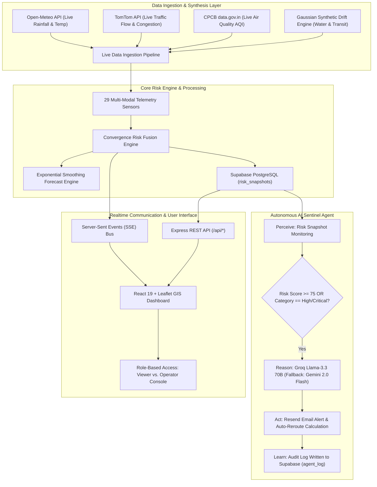

# 🌆 UrbanPulse: Mumbai Urban Digital Twin & Autonomous Risk Fusion Engine
> **Comprehensive Project Documentation & Technical Architecture Specifications**

---

## 📌 Executive Summary

**UrbanPulse** is a hyper-local **Urban Digital Twin and Risk Intelligence Platform** built specifically for the complex urban ecosystem of **Greater Mumbai**. By integrating live telemetry, predictive forecasting, risk-aware GIS routing, and an autonomous LLM-driven **Sentinel Agent**, UrbanPulse detects compound urban hazards before they escalate into disasters.

Unlike conventional municipal monitoring systems that evaluate environmental factors in isolation (e.g., rainfall tracked separately from road congestion), UrbanPulse introduces a **Convergence Risk Engine**. This engine continuously synthesizes multi-modal data streams across 12 critical Mumbai zones to calculate real-time risk index scores, project future threat horizons, and trigger automated emergency interventions.

---

## 🚨 The Core Problem: Compound Urban Stressors in Mumbai

Mumbai faces a unique urban crisis characterized by **overlapping municipal vulnerabilities**:

1. **Siloed Municipal Operations:** The India Meteorological Department (IMD), Mumbai Traffic Police, Central Pollution Control Board (CPCB), and Brihanmumbai Municipal Corporation (BMC) operate on isolated dashboards without cross-system data fusion.
2. **The "Compound Stressor" Trigger:** Disaster in Mumbai rarely stems from a single factor. A moderate rainfall event (40 mm/hr) becomes catastrophic only when coinciding with a 4.5m high tide surge, heavy evening traffic on LBS Road, and a major cricket match at Wankhede Stadium. Isolated systems fail to flag this multi-variable convergence in advance.
3. **Reactive vs. Proactive Emergency Routing:** Ambulances and emergency vehicles currently rely on consumer GPS navigation (e.g., Google Maps), which directs traffic onto flooded low-lying underpasses (such as Sion or Milan Subway) because it lacks awareness of live depth waterlogging and localized structural risk.

---

## 🏗️ System Architecture & Data Pipeline

UrbanPulse is architected as an event-driven, micro-service-oriented Digital Twin system:



---

## 📊 Math & Theoretical Models

### 1. Per-Zone Convergence Risk Fusion Formula

The risk score $R_z \in [0, 100]$ for a given zone $z$ is calculated using a dynamic weighted summation adjusted for severity non-linearities:

$$R_z = \min\left(100, \; \sum_{i=1}^{n} w_i \cdot S_i \cdot C_i + \delta_{\text{event}}\right)$$

Where:
- $S_i \in [0, 100]$: Normalized severity value of sensor reading $i$ (Rainfall, Traffic, AQI, Waterlogging, Transit Delay).
- $w_i$: Normalized weight assigned to factor $i$ (Default: Rain = 0.30, Traffic = 0.25, Water Level = 0.25, AQI = 0.10, Transit = 0.10).
- $C_i \ge 1.0$: Co-factor amplification multiplier. When both **Rainfall > 50 mm/hr** AND **Water Level > 0.4 m**, $C_{\text{flood}} = 1.45$.
- $\delta_{\text{event}}$: Bonus penalty added if an active public event (e.g., concert, sports match, political rally) overlaps with the zone.

### 2. Predictive Risk Forecasting Model

To project risk indices across $+15\text{ min}$, $+30\text{ min}$, and $+60\text{ min}$ horizons, UrbanPulse utilizes Double Exponential Smoothing with linear trend damping:

$$\hat{y}_{t+h} = \ell_t + h \cdot b_t$$
$$\ell_t = \alpha y_t + (1 - \alpha)(\ell_{t-1} + b_{t-1})$$
$$b_t = \beta (\ell_t - \ell_{t-1}) + (1 - \beta)b_{t-1}$$

Where $\alpha = 0.4$, $\beta = 0.2$, $\ell_t$ represents the current level, and $b_t$ represents the trend velocity. Confidence intervals $[L_h, U_h]$ are computed via variance extrapolation:

$$L_h, U_h = \hat{y}_{t+h} \pm z_{\gamma} \cdot \sigma_e \sqrt{h}$$

### 3. Risk-Aware A* Routing Cost Algorithm

Emergency route selection overlays risk penalties directly onto OpenStreetMap (OSM) road graph edges:

$$\text{Cost}(e) = \text{Distance}(e) \times \left(1 + \gamma \cdot R_{\text{zone}(e)} + \Phi_{\text{closure}}\right)$$

Where:
- $\text{Distance}(e)$: Physical road segment length in meters.
- $R_{\text{zone}(e)}$: Live risk index of the zone containing edge $e$.
- $\gamma = 0.05$: Penalty scaling factor.
- $\Phi_{\text{closure}} = \infty$ (or $10^6$): Impassable barrier applied if water logging in zone $(e) > 0.75\text{ m}$.

---

## 🗄️ Database Schema Specification (Supabase / PostgreSQL)

### `sensors`
Stores metadata for all 29 physical/virtual sensor nodes deployed across Mumbai.
```sql
CREATE TABLE sensors (
    id            UUID PRIMARY KEY DEFAULT gen_random_uuid(),
    name          TEXT NOT NULL,
    type          TEXT NOT NULL, -- 'rainfall' | 'traffic' | 'air_quality' | 'water_level' | 'transit_delay'
    zone_name     TEXT NOT NULL,
    lat           NUMERIC(9,6) NOT NULL,
    lng           NUMERIC(9,6) NOT NULL,
    unit          TEXT NOT NULL,
    created_at    TIMESTAMPTZ DEFAULT NOW()
);
```

### `readings`
High-frequency time-series telemetry ingested every 5 seconds.
```sql
CREATE TABLE readings (
    id            UUID PRIMARY KEY DEFAULT gen_random_uuid(),
    sensor_id     UUID REFERENCES sensors(id) ON DELETE CASCADE,
    value         NUMERIC NOT NULL,
    severity      TEXT NOT NULL, -- 'low' | 'moderate' | 'high' | 'critical'
    data_source   TEXT DEFAULT 'simulated', -- 'live_open_meteo' | 'live_tomtom' | 'live_cpcb' | 'simulated'
    created_at    TIMESTAMPTZ DEFAULT NOW() NOT NULL
);
```

### `risk_snapshots`
Zone-level aggregated risk index snapshot computed every 10 seconds.
```sql
CREATE TABLE risk_snapshots (
    id            UUID PRIMARY KEY DEFAULT gen_random_uuid(),
    zone_name     TEXT NOT NULL,
    score         NUMERIC NOT NULL,
    category      TEXT NOT NULL, -- 'low' | 'moderate' | 'high' | 'critical'
    factors       JSONB NOT NULL, -- Breakdown of individual factor scores
    created_at    TIMESTAMPTZ DEFAULT NOW() NOT NULL
);
```

### `events`
Active or upcoming public gatherings influencing zone crowd density.
```sql
CREATE TABLE events (
    id                  UUID PRIMARY KEY DEFAULT gen_random_uuid(),
    name                TEXT NOT NULL,
    zone_name           TEXT NOT NULL,
    event_type          TEXT NOT NULL, -- 'concert' | 'sports' | 'rally' | 'festival'
    expected_attendance INTEGER,
    start_time          TIMESTAMPTZ NOT NULL,
    end_time            TIMESTAMPTZ NOT NULL,
    created_at          TIMESTAMPTZ DEFAULT NOW()
);
```

### `agent_log` (Stage K Sentinel Audit Log)
Complete record of autonomous AI agent cycles, reasoning, and actions.
```sql
CREATE TABLE agent_log (
    id            UUID PRIMARY KEY DEFAULT gen_random_uuid(),
    zone_name     TEXT NOT NULL,
    risk_score    NUMERIC NOT NULL,
    risk_category TEXT NOT NULL,
    llm_decision  JSONB NOT NULL, -- { action_needed, action_type, explanation, confidence }
    action_taken  TEXT NOT NULL DEFAULT 'none', -- 'alert_sent' | 'reroute_computed' | 'none'
    triggered_by  TEXT NOT NULL DEFAULT 'sentinel_agent',
    created_at    TIMESTAMPTZ DEFAULT NOW() NOT NULL
);
```

---

## 🤖 Stage K: The UrbanPulse Sentinel Agent

The Sentinel Agent operates as an autonomous background service (`src/agent/sentinel.ts`) implementing a **Perceive → Reason → Act → Learn** loop executing every 60 seconds:

```
┌──────────────────────────────────────────────────────────────────┐
│  🤖 SENTINEL AGENT AUTONOMOUS LOOP                                │
├──────────────┬───────────────────────────────────────────────────┤
│ 1. PERCEIVE  │ Queries latest risk_snapshots from Supabase DB    │
│              │ Filters for zones with High or Critical risk      │
├──────────────┼───────────────────────────────────────────────────┤
│ 2. REASON    │ Dispatches telemetry JSON to Groq Llama-3.3 70B   │
│              │ Fallback: Gemini 2.0 Flash → Rule-based Engine    │
│              │ Returns JSON: { action_needed, action_type, ... } │
├──────────────┼───────────────────────────────────────────────────┤
│ 3. ACT       │ Dispatches email alert via Resend SDK             │
│              │ Triggers A* emergency rerouting engine            │
│              │ Broadcasts agent_cycle SSE event to frontend      │
├──────────────┼───────────────────────────────────────────────────┤
│ 4. LEARN     │ Inserts decision record into agent_log table      │
└──────────────┴───────────────────────────────────────────────────┘
```

---

## 🔌 REST API Specification Reference

| Endpoint | Method | Description | Response Example |
|---|---|---|---|
| `/health` | `GET` | Health check endpoint | `{ "status": "ok", "uptime": 3421 }` |
| `/api/sensors` | `GET` | List all 29 active sensors | `[{ "id": "...", "name": "Dadar TT", ... }]` |
| `/api/sensors/:id/readings` | `GET` | Telemetry history for sensor | `[{ "value": 42.5, "created_at": "..." }]` |
| `/api/risk/current` | `GET` | Current 12 zone risk snapshots | `[{ "zone_name": "Sion", "score": 82.4 }]` |
| `/api/risk/history` | `GET` | Historical risk index trends | `{ "Sion": [65, 72, 82.4] }` |
| `/api/events` | `GET` | Active urban events | `[{ "name": "IPL Match", "zone": "Marine Drive" }]` |
| `/api/route` | `POST` | Calculate risk-aware A* route | `{ "distanceM": 4520, "path": [...] }` |
| `/api/agent/history` | `GET` | Fetch Sentinel Agent log history | `{ "entries": [{ "zone_name": "Vikhroli", ... }] }` |
| `/api/realtime/stream` | `GET` | Server-Sent Events (SSE) stream | `event: message\ndata: {...}` |

---

## 💻 Frontend & UI Features (React 19 + Tailwind)

1. **Risk Twin View:** Interactive Leaflet map centered over Greater Mumbai (`19.0760° N, 72.8777° E`). Features zone polygons, risk heat overlays, and sensor markers with custom severity pins.
2. **Sensor Net View:** Real-time grid of all 29 sensors with sparkline trend charts, live values, and data source badges (`LIVE: Open-Meteo`, `LIVE: TomTom`, `MOCK`).
3. **Emergency Route Optimizer:** Interactive map coordinate picker. Displays origin (A), destination (B), path avoidance metrics, and detour reasons.
4. **Sentinel Agent Console:** Dedicated console tab featuring live stage progress indicators, 60s countdown timer, expandable log entries, confidence percentages, and LLM explanation details.
5. **What-If Scenario Simulator:** Interactive slider panel allowing operators to inject artificial deluges, traffic gridlocks, or high tides to observe real-time citywide resilience reactions.
6. **Authentication & Roles:** Built-in Supabase Auth support with **Viewer** (read-only) and **Operator** (full access + agent console) roles, plus a zero-configuration Demo Mode bypass.

---

## 🛠️ Step-by-Step Local Setup & Execution Guide

### Prerequisites
- Node.js (v18 or higher)
- npm (v9 or higher)
- Supabase Account & Database

### 1. Clone & Install Dependencies
```bash
git clone https://github.com/your-username/UrbanPulse.git
cd UrbanPulse

# Install Backend Dependencies
cd backend
npm install

# Install Frontend Dependencies
cd ../frontend
npm install
```

### 2. Environment Configuration

Create `backend/.env`:
```env
PORT=3001
NODE_ENV=development
SUPABASE_URL=https://your-project.supabase.co
SUPABASE_SERVICE_KEY=your-supabase-service-role-key

GROQ_API_KEY=your-groq-api-key
GEMINI_API_KEY=your-gemini-api-key
RESEND_API_KEY=your-resend-api-key
RESEND_FROM=onboarding@resend.dev
ALERT_EMAIL=your-control-room@example.com

TOMTOM_API_KEY=your-tomtom-uuid-key # Optional
```

Create `frontend/.env`:
```env
VITE_SUPABASE_URL=https://your-project.supabase.co
VITE_SUPABASE_ANON_KEY=your-supabase-anon-key
```

### 3. Database Migration & Seeding
In your Supabase SQL Editor, run `migrations/001_initial_schema.sql` through `migrations/004_agent_log.sql`. Then seed the database:
```bash
cd backend
npm run seed
```

### 4. Start Local Development Servers
Terminal 1 (Backend):
```bash
cd backend
npm run dev
```

Terminal 2 (Frontend):
```bash
cd frontend
npm run dev
```

Open `http://localhost:5173` in your browser.

---

## ☁️ Production Deployment Architecture (Netlify + Render + Supabase)

- **Frontend:** Hosted on **Netlify** with single-page app (SPA) rewrite rules configured via [`frontend/netlify.toml`](file:///d:/projects/UrbanPulse/frontend/netlify.toml).
- **Backend:** Deployed as a Web Service on **Render** running `npm run build && npm start`.
- **Database:** Fully managed **Supabase PostgreSQL** instance with automated connection pooling.

---

## 🎯 Presentation (PPT) Slide-by-Slide Script

| Slide # | Slide Title | Visual / Content | Speaker Script |
|---|---|---|---|
| **Slide 1** | UrbanPulse: Mumbai Digital Twin | Logo, Mumbai map graphic, Title & Team name | *"Good morning. Today we present UrbanPulse — an AI-powered Digital Twin and Autonomous Risk Fusion Platform designed for Greater Mumbai."* |
| **Slide 2** | The Problem | Split screen: Flooded Sion underpass vs. isolated municipal dashboards | *"Mumbai suffers from overlapping urban stressors. Rainfall, high tides, and traffic are monitored in silos. When they converge, catastrophic failure occurs before existing systems notice."* |
| **Slide 3** | The Solution | 3D Digital Twin Map screenshot with risk heatmaps | *"UrbanPulse solves this by continuously fusing multi-modal sensor telemetry into a dynamic 0–100 per-zone risk index, predicting risk 60 minutes into the future."* |
| **Slide 4** | Tech Stack & Architecture | Architecture diagram (Data → Express → Sentinel Agent → React UI) | *"Our architecture uses Node.js/Express for backend fusion, Supabase Postgres for persistence, React 19 for rendering, and Server-Sent Events for instant live updates."* |
| **Slide 5** | Emergency Pathfinding | Risk-aware A* routing UI showing flood bypass | *"Unlike standard GPS maps, our Emergency Route Optimizer penalizes high-risk zones and automatically routes ambulances around flooded underpasses using real OpenStreetMap networks."* |
| **Slide 6** | Stage K: Autonomous Sentinel Agent | Agent Console screenshot (Perceive → Reason → Act → Learn) | *"Our flagship feature is the Sentinel Agent. Every 60 seconds it perceives risk, reasons using Groq Llama-3.3 70B, dispatches alerts via Resend, and records an audit log to Supabase."* |
| **Slide 7** | Live Demo & Results | Live video recording or screenshots of dashboard | *"Here we see the live system in action — detecting critical risk in Vikhroli and Sion, animating agent reasoning stages, and generating predictive forecasts."* |
| **Slide 8** | Future Roadmap & Conclusion | Summary bullets: IoT hardware integration, BMC civic API hookup | *"In conclusion, UrbanPulse transforms reactive city management into proactive, autonomous urban intelligence. Thank you!"* |

---

*UrbanPulse Project Documentation — Final Version (Stage K Complete)*
