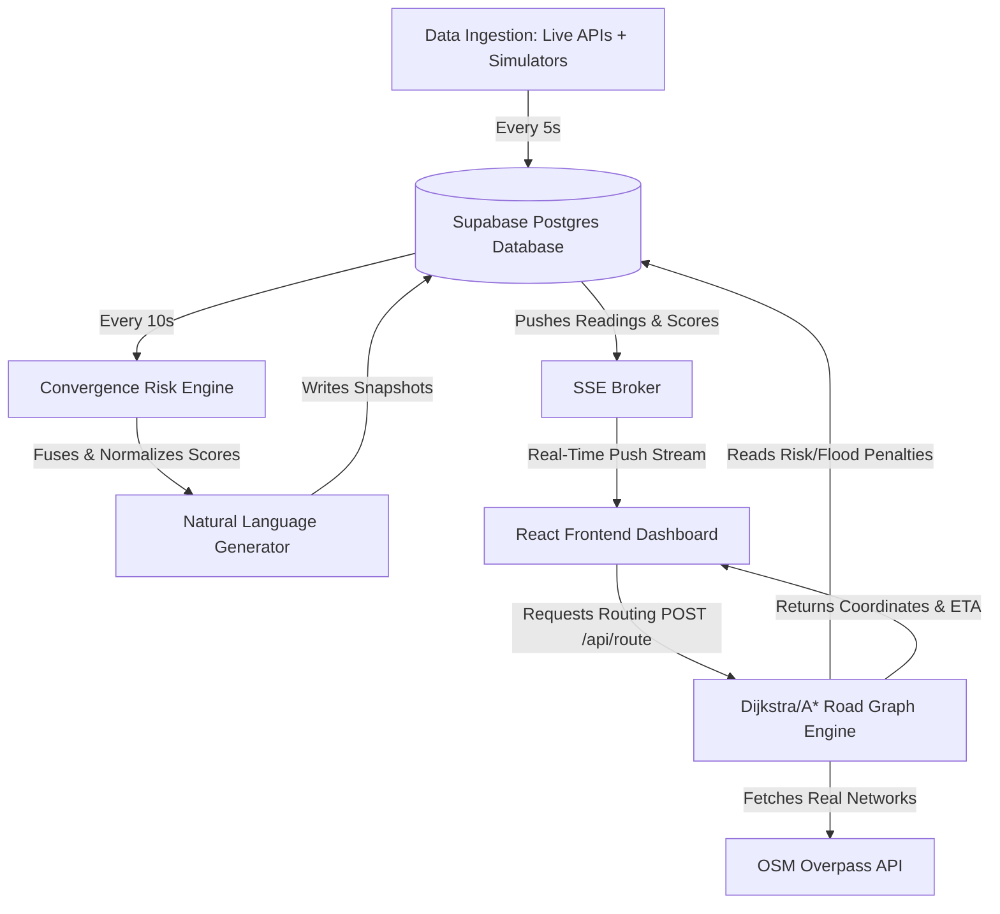

# 🌆 UrbanPulse: Convergence Intelligence & Digital Twin Platform

[](https://opensource.org/licenses/MIT)
[](https://react.dev)
[](https://nodejs.org)
[](https://supabase.com)
[](https://leafletjs.com)

**UrbanPulse** is a convergence-aware urban digital twin and risk monitoring dashboard covering **Greater Mumbai** across 29 sensor stations spanning 12 city zones.

Traditional smart-city systems monitor rainfall, traffic congestion, and air quality in isolated vertical silos. UrbanPulse solves the problem of **overlapping stressors**: minor independent incidents (e.g., typical evening rush hour traffic combined with moderate rainfall and poor local drainage) that, when aligned, trigger sudden systemic urban paralysis. Fusing live environmental APIs with localized simulated telemetry, UrbanPulse computes real-time composite risk indices, broadcasts predictive alerts, recommends emergency mitigating actions, and calculates risk-aware emergency route optimizations on real OpenStreetMap road graphs spanning the full city.

---

## 🖼️ User Interface & Visual Tour

The platform features a highly responsive, custom-styled digital twin layout with an integrated interactive map and floating control panels.

```
+-----------------------------------------------------------------------+
|  [🌆 UrbanPulse Mumbai]       [🔔 Alerts (3)]   [☀️ Light/🌙 Dark]     |
+-------------------+---------------------------------------------------+
|  [ Risk twin ]    |                                                   |
|  [ Sensor Net ]   |                 [ LEAFLET MAP VIEW ]              |
|  [ Routing ]      |                                                   |
|                   |         - Displays colored circular risk heatmaps |
|  [SIDEBAR PANEL]  |         - Real-time sensor pins & markers         |
|  Showcases active |         - Interactive emergency route polylines   |
|  tab, statistics, |                                                   |
|  details, spark-  |                                                   |
|  lines, & weights |                                                   |
+-------------------+---------------------------------------------------+
|  [⚡ SIMULATION CONTROLS] Cloudburst | Rush Hour | Smog | Custom Value |
+-----------------------------------------------------------------------+
```

### 📸 Recommended Screenshots (Add your own graphics here)
*   **Main Dashboard (Dark Mode)**: Place a screenshot at `docs/images/dashboard_dark.png` showing the overall city risk index, ranked top 5 hotspots with custom-filled SVG sparklines, and translucent circular zone risk overlays.
*   **Zone Inspector Drawer**: Place a screenshot at `docs/images/zone_inspector.png` showing active contributing factor progress bars, natural language explanations computed by the risk engine, and the 1-hour historical sparkline trend.
*   **Emergency Route Optimizer**: Place a screenshot at `docs/images/routing_active.png` showing the A*/Dijkstra route navigating across Greater Mumbai, avoiding critical flood-closed streets or high-congestion sectors.
*   **What-If Simulation Dashboard**: Place a screenshot at `docs/images/simulator_active.png` showing a triggered Monsoon Cloudburst scenario instantly shifting zone risk layers to red and generating alarm cards in the warnings drawer.

---

## 🚀 Key Features

*   **Composite Convergence Risk Engine**: Evaluates traffic density, rainfall rates, AQI levels, and street water heights to compute a unified `0–100` risk index. Dynamically normalizes for zones missing specific sensors.
*   **Interactive Digital Twin Map**: Lightweight Leaflet interface utilizing OpenStreetMap tiles. Displays color-coded risk circular overlays (Green/Yellow/Orange/Red), sensor station pins, and customizable dark/light map filters.
*   **Emergency Route Optimizer**: Integrates a pathfinding engine utilizing real road networks fetched from the OpenStreetMap Overpass API for **all of Greater Mumbai**. Runs Dijkstra/A* routing where edge costs increase dynamically through high-risk zones, and blocks paths completely through flood-closed streets.
*   **Real-time Push Stream (SSE)**: Uses Server-Sent Events (SSE) to push sensor readings and computed risk updates from the backend to the client instantly, eliminating HTTP polling.
*   **What-If Scenario Simulator**: Allows planners to pause automated background drifts and inject simulated disaster scenarios (such as *Monsoon Cloudburst, Evening Office Rush Hour, or Winter Smog*) to stress-test routing and contingency operations.
*   **Interactive Weight Tuning**: Provides sliders on the frontend sidebar to adjust the contribution weights of rainfall, traffic, AQI, and water level, instantly updating and propagating risk scores.
*   **Sensor Telemetry Modals**: Renders interactive SVG area line charts displaying historical sensor readings plotted against threshold limits.
*   **Predictive Warnings & Alerts**: Broadcasts system-wide notification cards when zone risk levels cross critical thresholds or are projected to do so in the next 15–30 minutes based on linear trend forecasting.

---

## 🧠 How It Works & Architecture

UrbanPulse operates on a pipeline that continuously ingests, fuses, and pushes environmental data:



1.  **Ingestion Layer**: Ingests traffic flow, rainfall data, and air quality indexes. It combines live external API responses with localized simulated telemetry (e.g. water levels) and logs them into Supabase.
2.  **Risk Fusion Engine**: Every 10 seconds, the backend reads the latest readings, computes a composite score using weight profiles, builds a natural language explanation of the contributing hazards, and stores the snapshot.
3.  **Delivery Layer**: A persistent Server-Sent Events (SSE) stream detects new snapshots and pushes them instantly to the client UI.
4.  **Routing Layer**: On a `POST /api/route` request, the server fetches the latest risk state, updates edge weights on the OSM road graph, and returns path coordinates.

---

## 📊 Data Ingestion Feasibility

The pilot integrates a hybrid dataset to ground the digital twin in real-world conditions while simulating telemetry where public infrastructure APIs are missing:

| Signal | Source | Integration Type | Caching & Safeguards |
| :--- | :--- | :--- | :--- |
| **Rainfall** | [Open-Meteo API](https://open-meteo.com/) | **Live** (Free, no key) | Batched coordinate requests; cached for 60s. |
| **Traffic Flow** | [TomTom Traffic Flow API](https://developer.tomtom.com/) | **Live** (Free Developer Tier Key) | Point-based speeds; cached for 5m to protect rate limits. |
| **Air Quality** | [CPCB via Data.gov.in](https://data.gov.in/) | **Live** (Free Portal Key) | Queries nearest active CPCB station; cached for 5m. |
| **Water / Flood Levels** | Localized Grid Sensor | **Simulated** | Modeled using Gaussian drift with storm spike probability. |
| **Transit Delays** | BEST/Western Railway | **Simulated** | Correlated with traffic congestion and rainfall intensity. |

---

## 💻 Tech Stack & Rationale

*   **Frontend**: React 19 + TypeScript. Chosen for component-based rendering, fast state updates, and robust compile-time safety.
*   **Backend**: Node.js + Express + TypeScript. Offers asynchronous performance, a lightweight HTTP server, and simple native SSE streaming.
*   **Database**: Supabase (PostgreSQL). Provides a managed relational database with Row-Level Security (RLS) and quick setup.
*   **Mapping**: Leaflet. Renders standard OpenStreetMap tiles efficiently without commercial mapping license locks or heavy bundle footprints.
*   **Styling**: Tailwind CSS. Utility-first system making light/dark mode styling changes and custom animations clean and maintainable.

---

## 🛠️ Getting Started

### 📋 Prerequisites
*   Node.js (version 20 or higher)
*   npm (version 10 or higher)
*   A free [Supabase](https://supabase.com/) account
*   *(Optional)* A [TomTom Developer account](https://developer.tomtom.com/) and [Data.gov.in API key](https://data.gov.in/) for live traffic/AQI feeds.

### 🔌 Database Setup
1.  Create a new project in your Supabase dashboard.
2.  Open the **SQL Editor** in Supabase and create a new query.
3.  Copy and run the contents of the following migration scripts in order:
    *   [`migrations/001_initial_schema.sql`](./migrations/001_initial_schema.sql) (Core tables: `sensors`, `readings`, `risk_snapshots`)
    *   [`migrations/002_event_schema.sql`](./migrations/002_event_schema.sql) (Event schedule tracking table)
    *   [`migrations/003_add_data_source.sql`](./migrations/003_add_data_source.sql) (Source tags for telemetry)

### ⚙️ Environment Configuration
Navigate to the `backend/` directory, copy the example environment file, and edit its values:

```bash
cd backend
cp .env.example .env
```

Edit your `.env` file to contain your Supabase credentials:

```env
SUPABASE_URL=https://your-project-id.supabase.co
SUPABASE_SERVICE_KEY=your-supabase-service-role-key-never-commit
PORT=3001
NODE_ENV=development

# Optional live API integration keys:
TOMTOM_API_KEY=your-tomtom-developer-api-key
DATA_GOV_API_KEY=your-datagov-cpcb-api-key
```

### 🌱 Database Seeding
With your `.env` configured, run the seed script once to populate the 29 Mumbai sensor stations and initial public events:

```bash
npm run seed -- --force
```

### 🏃 Running Locally

Start the backend API server and simulation loop:
```bash
cd backend
npm install
npm run dev
```

In a new terminal window, start the React Vite dev server:
```bash
cd frontend
npm install
npm run dev
```

Open `http://localhost:5173` in your web browser to view the interactive dashboard.

---

## 📂 Project Structure

```
UrbanPulse/
├── migrations/                  # Database schema migration SQL files
│   ├── 001_initial_schema.sql
│   ├── 002_event_schema.sql
│   └── 003_add_data_source.sql
├── docker-compose.yml           # Optional backend containerization configuration
├── backend/                     # Node.js API Service
│   ├── src/
│   │   ├── index.ts             # Express server & SSE event stream setup
│   │   ├── config/
│   │   │   └── riskWeights.json # Tunable risk calculation weights
│   │   ├── data/
│   │   │   └── sensors.ts       # Seeds for Mumbai sensor coordinates
│   │   ├── lib/
│   │   │   └── supabase.ts      # Supabase client connector
│   │   ├── routes/
│   │   │   ├── sensors.ts       # Readings & sensor inventory routes
│   │   │   ├── risk.ts          # Zone composite risk index queries
│   │   │   ├── events.ts        # Public event routing
│   │   │   └── route.ts         # Route optimization endpoints
│   │   └── services/
│   │       ├── liveDataService.ts   # Live weather, traffic, and AQI fetch engine
│   │       ├── riskEngine.ts        # Dynamic weight normalizing risk evaluator
│   │       ├── roadGraph.ts         # OpenStreetMap OSM graph builder
│   │       └── routeEngine.ts       # Dijkstra/A* pathfinder
└── frontend/                    # React UI Client
    ├── src/
    │   ├── App.tsx              # Main dashboard wrapper & Leaflet mapping logic
    │   ├── index.css            # Base styles and map canvas settings
    │   ├── components/          
    │   │   ├── Sparkline.tsx        # High-performance custom SVG sparklines
    │   │   ├── SensorHistoryModal.tsx # Interactive historical telemetries
    │   │   └── SimulationPanel.tsx  # Scenario selector dashboard UI
    │   └── utils/
    │       └── severity.ts      # Colors and thresholds for risk scales
```

---

## 🗺️ Roadmap & Future Directions

*   **Graph Neural Network (GNN) Forecasting**: Replaces standard linear trend forecasting with spatial GNNs to predict how risk in one zone (e.g. Kurla) will physically propagate to adjacent zones (e.g. Sion) 30 minutes in advance.
*   **Active Event Context integration**: Feeds the active event schedules (from the `events` table) directly into traffic predictions and routing weights, penalizing segments near stadiums or festival grounds during start/end hours.
*   **Expansion to Additional Municipalities**: Adapts the schema and Overpass fetchers to handle other coastal cities prone to heavy seasonal monsoons (e.g. Chennai, Kolkata).

---

## 📄 License & Credits

This project is licensed under the MIT License - see the [LICENSE](LICENSE) file for details.

Developed for **UrbanPulse Mumbai Digital Twin** by [Your Name / Portfolio Link].
